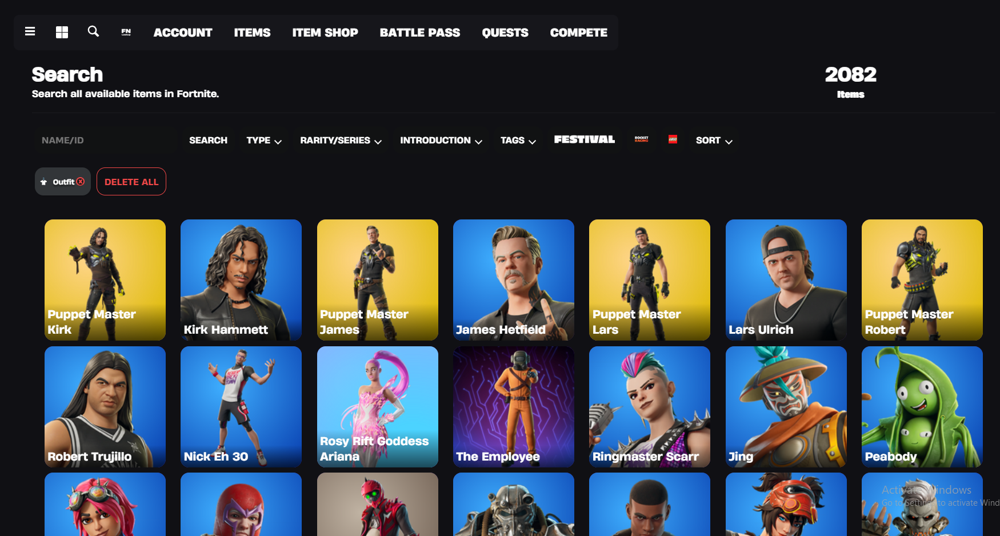
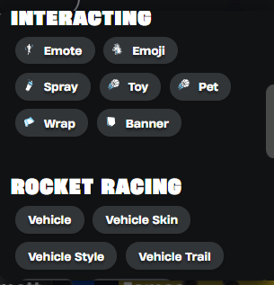
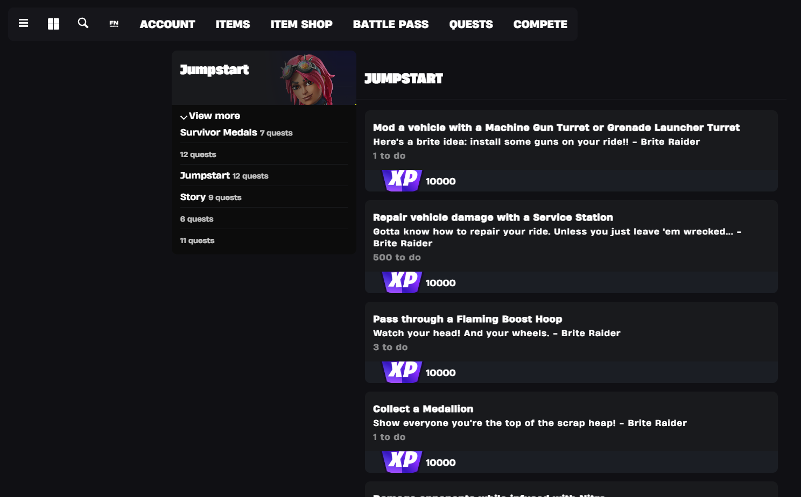
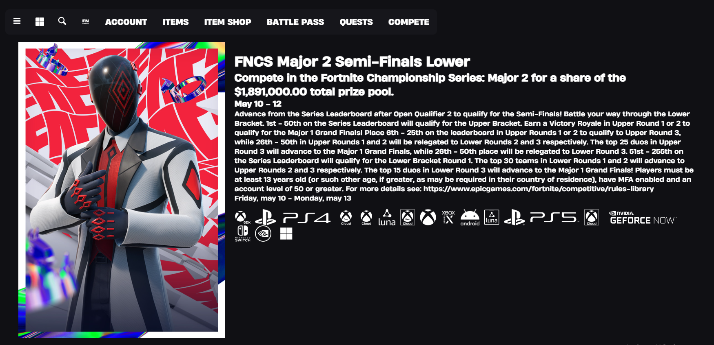
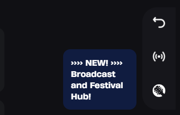
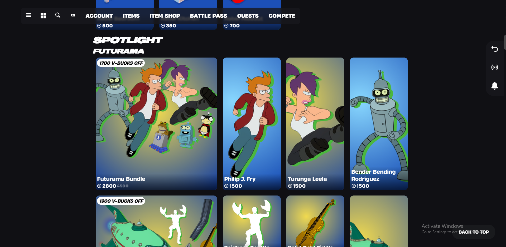
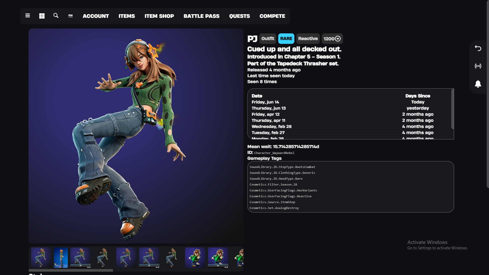

# Welcome FNLookup 3!

## Written by: tposejank

The newly redesigned FNLookup 3 is available now.

Let's start off by saying that FNLookup needs to be hyped up!
**Share it!**

Back to discussion...

## New features

During the time of development, FNLookup has gotten a lot of new features!

### Account Page

The account page is where you can view linked accounts.
You can link any account you want!

The home page now displays Ranked stats! To see them, you must have a linked account.

You can also change your language here, and view FNLookup's about page.

### Updated Items Page 

The **Items** page now has an updated design!

You can now sort between items from **LEGO Fortnite**, **Fortnite Festival**, and **Rocket Racing**.

There are also more filters to choose from:

- Type:
    - Interacting
    - Rocket Racing
    - Fortnite Festival
    - LEGO Fortnite
    - Additional
- Tags:
    - Source
    - Platform Exclusive

### Redesigned Quests Page

The Quests page now has an updated design.

Rewards will no longer be on the right of the quest, hoverable. Instead, they will be put under it and slightly cropped.

At the left, you can pick which category of quests to view by clicking **View more**.

### Compete Page

The Compete (Tournaments) Page now has an updatated design.

Tournaments will be viewable in a list pattern, and clicking on one will bring you to a sub-page where you can view all the details of the tournament.

**This still needs reworks.**

### Side-bar navigation

A new widget has appeared on the right of your screen!

This small 3-button bar is designed to enhance your experience on the webpage.

#### Functionality

*On the home page, the 'Back' arrow will not appear.*

The **Back** arrow can be used to return to the previous page.

The **Broadcast** feature is the next button.

The **Notifications** will appear at the bottom, where you will soon be able to view notifications.

### Item Shop Redesign

Since all of you are tracked anyway by the Fortnite API, I have figured I may take a peek at what you use the most. And what, it's the **Item Shop**!

You now have a **Jump to category** button at the top, to jump to a specific category.

The design of the Item Cards have been updated.

On the bottom right, you have the **Back to top** button which will, take you back to the top of the page.

### Item Page - Small Update

The Item Page has received an updated design.

New fonts are used, and the Images have moved to a scrollable box.

Skin Previews have been fixed. To view a Skin Video, click on the second 'item' on the Images bar.

While the video is playing, you can swap styles by clicking on the bottom style buttons.

Times are now based relatively.

## Conclusion

That's it for the changelog. Thank you very much for tuning in!